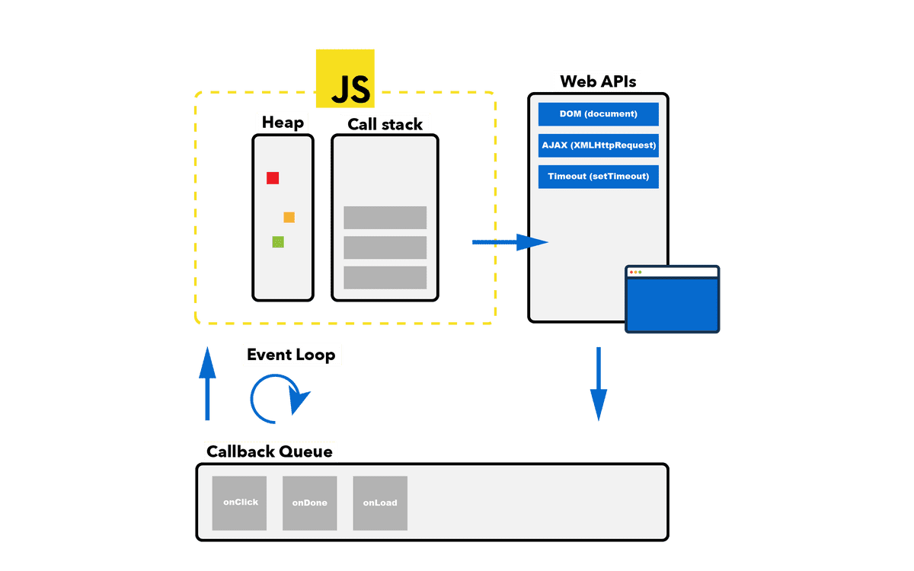
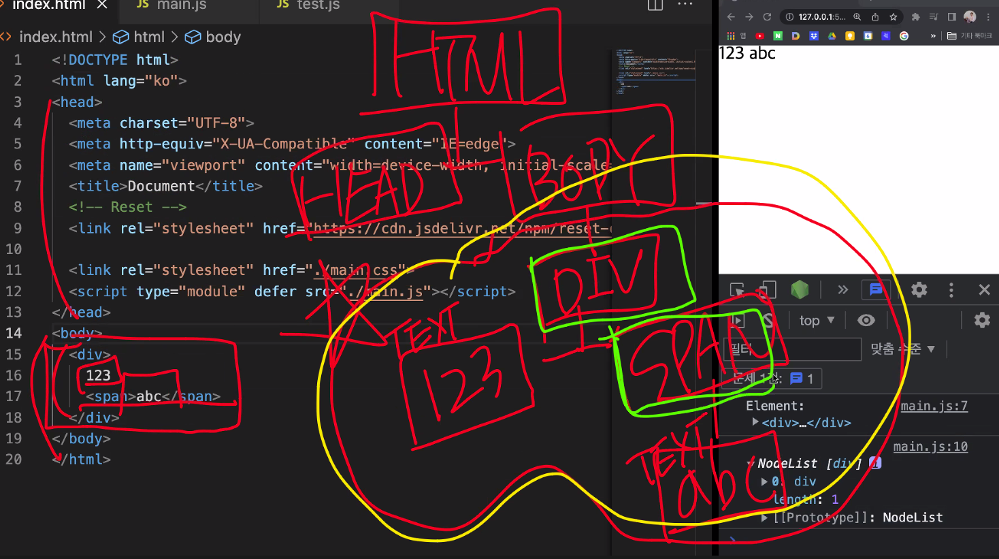

## 가지고 오기 

```js

//ESM
export const named1 = {
  a: 1,
  b: 2
}

export const named2 = 123

export default function () {
  return 'abc'
}

//CommonJS // nodeJS에서!!
const path = require('path')
const _ = require('lodash')
module.exports = {
  a: 1,
  b: 2
}
```

```JS
import { named1 as heropy, named2} from './test.js'
```

node.js 는 로컬 환경을 제어하는 것이라고 생각해야함
우리는 js를 브라우저를 제어하는 방법으로 배우는 중!! 

node.js 는 Common.js 지원(Common.js는 기본 내보내기가 없다.)


## Call Stack && Event Loop



호출하는 함수가 call stack에 차곡차곡 쌓임
 

 ```js
 // call stack && event loop

function a() {
  function b()  {

  }
  b()
} 
a()

document.querySelector('input').addEventListener('keydown', () => {

})

// 
```
addEventListener 속의 callback은 어디에 저장이 되었다가 실행되나?
web APIs 에서 DOM 제어에서 callback queue(대기열)에 들어감.  callstack이 비워지면 event loop를 통해서 callback queue에 있던 것들이 call stack에 들어가게됨. 

```js
setTimeout(() => {
  //wep APIs로 들어갔다가 callback queue(메크로 타스크)에 들아갔다가 callstack가 비워지면 event Loop로 callstack으로 들어간다.
}, 0) 
```

실습 
```js
// call stack && event loop

setTimeout( () => {
  console.log('timeout')
}, 1000)
function a() {
  console.log('a')
  function b() {
    console.log('b')
  }
  b()
}

a()
// a
// b
//timeout
```

만약 0초 라면!!
```js
// call stack && event loop

setTimeout( () => {
  console.log('timeout')
}, 0)
function a() {
  console.log('a')
  function b() {
    console.log('b')
  }
  b()
}

a()
// a
// b
//timeout
```
setTimeout의 콜백은 Web APIs라서 0초로 설정되어 있지만 callback queue에 쌓임!!!바로 callstack에 못 쌓음. 그리서 call stack에 있는 미리 쌓여있는 a, b함수가 먼저 실행되고 callstack이 비워지면 그 다음에 event loop로 call stack으로 들어갈 수 있다!! js 를 브라우저라는 런다임이나 노드js의 런타임에서 들어감. setTimeout이 브라우저가 실행하는 명령이라서!!! 나중에 실행될 수 밖에 없다. 

만약 setTimeout 코드 다음에 밑에 함수가 10만개가 있다면 그 함수가 다 실행되고 난 다음에 setTimeout을 실행할 수 있다. 비동기도 Web APIs이다. 그래서 call stack이 다 비워지면 비동기가 callback queue에서 나와서 callstack에서 실행될 수 있다. 

vue.js에서 이 개념을 자주 사용하는 경우가 있을 거임!! 

대표적으로 볼 것이 DOM event, Timeout, 비동기 처리 등이 web APIs 
event loop를 통해서 callback queue에 있는 것을 호출하려면 call stack이 비워져 있어야 한다. 

참고 사이트 > http://latentflip.com/loupe/

이 사이트에서는 화살표 함수는 안 읽혀서 다 일반 함수로 작성해서 test 하기를 바란다. 


## DOM(Document Object Model) 


### Element & NODE 

#### Element 
`document.querySelector('div')` 
querySelector는 요소를 찾아준다.

- DOM 탐색하기 
```js
//DOM
//Document Object Model

const divEl = document.querySelector('div')
console.log(divEl.id) //하나의 문자데이터로 아이디를 출력해줌 2개라도 'abc efg'로 한개의 문자로 해줌. 
console.log(divEl.id.split(' '))// 아이디를 여러개를 각각 받 고 싶으면 split 을 사용해서 배열로 반환가능

console.log(divEl.className)// div의 class 값을 반환해줌 !! 'btn btn-xs'와 같이 여러 클래스가 있는 경우가 많은데 문자열 하나로 반환해줘서 귀찮음..

//클래스 추가(add), 제거(remove), 확인(contains)
console.log(divEl.classList.add('hropy'))
console.log(divEl.classList.remove('hropy'))
console.log(divEl.classList.contains('hropy')) // true //false
```

`document.getElementById('abe')`

예전에는 성능때문에 querySelector보다 getElementById를 썼었는데 지금은 상관없는 정도!!

```js
const divEl = document.querySelector('div')
//부모요소
console.log(divEl.parentNode)
//이전 형제 요소 
console.log(divEl.previousElementSibling)
//이후 형제 요소 
console.log(divEl.nextElementSibling)

//나의 부모의 다음 형제 
console.log(divEl.parentNode.nextElementSibling)
```

html 구조 보기 
```js
const divEl = document.querySelector('div')

console.log(divEl.innerHTML)//이 요소의 내부 html 구조를 얻을 수 있다. 
console.log(divEl.textContent) // 이 요소가 가지고 있는 내용 중에 text만 보기!! 
//innerText는 쓰지말기!!
```

innerHTML, textContent 는 getter이자 setter임!!
```js
divEl.textContent = '<h1>hello</h1>' // 그냥 문자로 넣어줌
divEl.innerHTML = '<h1>hello</h1>' //html 요소로 넣어줌
```

요소를 넣을때!! 

```js

// 권장 X
divEl.append('<h2>Hi!</h2>') //내부의 뒤에 text로 들어감
divEl.prepend('<h2>Hi!</h2>')//내부의 앞으로 text로 들어감

//권장
const h2El = document.createElement('h2')
h2El.textContent='hi!!'
divEl.append(h2El)

h2El.innerHTML=/* html */`<h1>hello</h1>` 
divEl.append(h2El)
```

여러가지 넣을때!!
```js
const h2El = document.createElement('h2')
h2El.textContent='hi!!'
const h2El2 = document.createElement('h2')
h2El2.textContent='hi!!'
divEl.append(h2El, h2El2)

// 반복문 써서 넣기
let h2Els = []
for (let i = 0; i < 10; i += 1){
  const h2El = document.createElement('h2')
  h2El.textContent = i
  h2El2.push(h2El)
}
divEl.append(...h2Els)//전개 연산자를 넣어서 배열의 괄호를 없애줘야함. 그리고 넣는거는 한번에 넣어야한다!! 
```

요소에서 지정할 수 있는 속성들
```html 
  <div title="안녕!!"></div>
```

js
```js
const divEl = document.querySelector('div')

//attributes
console.log(divEl.getAttribute('title')) // title 속성을 가지고옴~
divEl.setAtribute('title', 'abbaba') //title 속성의 값이 지정됨
```

dataset
요소에 data를 가지고 태워보기!! data-이름 html 요소에 data를 잠깐 보간해 두는 용도!!
```html
<div title="안녕!!" >1 2 3 </div>
```

js
```js

//dataset
const user = {
  name: 'Flyda',
  age: 85
}
divEl.dataset.user = JSON.stringify(user)
console.log(JSON.parse(divEl.dataset.user))
```

html이랑 js에서!!

```html 
<div title="안녕!!" data-user-name = "Flyda!">1 2 3 </div>
```
```js
const divEl = document.querySelector('div')
//dataset
console.log(divEl.dataset.userName)
```
html 에서  user-name이라고 했지만, js는 userName로 써야한다. lodash에서 `_.kebabCase()`를 사용해서 변환해줘야한다!! 안하면 탕비실잼.. 예의 없다!! ㅋㅋ

```js
//요소 크기 알아내기 
console.log(divEl.clientWidth,divEl.clientHeight)

//요소 위치
console.log(divEl.clientTop)
console.log(divEl.clientLeft)

// 요소 렌더링 정보 // 사각형이 화면에서 가지고 있는 모양 알아보기!! 중요!! 
console.log(divEl.getBoundingClientRect()) //DOMRect 정보..
// 호출될때 마다 화면을 계산해야하기때문에 남발 X! 유용하지만 주의하기!!

// 요소 추가하기 
const h1El = document.createElement('h1')
h1El.id = 'abc'
//h1El.setAttribute('id', 'abc')
h1El.setAttribute('title', '123')
h1El.className.padEnd('btn')

document.body.append(h1El) 
```


#### NODE 
유사 배열 

`document.querySelectorAll('div')`

querySelectorAll는 NodeList를 찾아준다. Node는 div가 가지고 있는 전체 구조...! 보통 Node는 대문자로 씀. ! 


노랑은 노드, 초록은 element

```js
const divEl = document.querySelector('div')
console.log('Element: ', divEl.childNodes)

const divEls = document.querySelectorAll('div')
console.log('', divEls)
divEls.forEach(el => {
  console.log(el)
})

for (const el of divEls) {
  console.log(el)
}
```


있으면 편한거 
> Comment tagged templates : https://marketplace.visualstudio.com/items?itemName=bierner.comment-tagged-templates


### Event handler == Callback

```js
const divEl = document.querySelector('div')

// const hanlder = function () {
// 함수내용
// }
// divEl.addEventListener('click', hanlder)

divEl.addEventListener('click', event => {
  console.log(event) //event의 target 부분이 중요! 
}) 
```
이벤트가 발생한 상황과 환경에 대한 객체를 가지고 있다.  


```js
const divEl = document.querySelector('div')
const inputEl = document.querySelector('input')

// const hanlder = function () {
// 함수내용
// }
// divEl.addEventListener('click', hanlder)

divEl.addEventListener('click', event => {
  console.log(event) //event의 target 부분이 중요! 
}) 


//대화형!! 사용자가 입력할 때 마다
inputEl.addEventListener('input', event => {
  console.log(event) //data 속성(입력한 값), target 중요
  //input은 value라는 속성에 사용자가 입력한 데이터가 들어 있음.! 
  console.log(event.target.value) //evet의 target에 입력된 값
})
//event.key
inputEl.addEventListener('keydown', event =>{
  console.log(event.target.value)
})
//keydown, keyup은 한글을 입력할때 엔터를 치면 2번 입력되는 이슈가 있음. 
//그럴때는 이렇게 해결하기!! 
inputEl.addEventListener('keydown', event =>{
  console.log(event.isComposing)// 어떤 키를 눌렀을 때 한글이 입력이 끝나지 않으면 true
  if (event.isComposing) return  // 이코드로 해결!!
  console.log(event.target.value)
})
```


## **예습하기!!**
- prevent default /기본 동작 방지
- stop propagation  / 이벤트 버블링 정지 
- 이벤트 버블링 vs 이벤트 캡처링

캡처링 
```js
inputEl.addEventListener('keydown', event =>{
  console.log(event.isComposing)// 어떤 키를 눌렀을 때 한글이 입력이 끝나지 않으면 true
  if (event.isComposing) return  // 이코드로 해결!!
  console.log(event.target.value)
}, {capture: true})
```

- currentTarget vs target

`event.target`

- event 종류 
  - click, input, keydown, mousemove, mouseenter, mouseleave, scroll, resize


꿀팁!!: 
> thunder client 사용하기!! :  https://webruden.tistory.com/840
> 검색어 자동완성은 db에 있는 것을 찾아서 출력해주는 거라서 api를 받아와야한다. 

