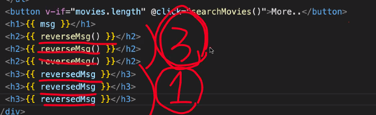

# vue 기초 


## 영화 예제 만들기 
```html
<!DOCTYPE html>
<html lang="ko">
<head>
  <meta charset="UTF-8">
  <meta http-equiv="X-UA-Compatible" content="IE=edge">
  <meta name="viewport" content="width=device-width, initial-scale=1.0">
  <title>Document</title>
  <script src="https://unpkg.com/vue@next"></script>
  <script type="module" defer src="./main.js"></script>
</head>
<body>
  <div id="app">
    <input v-model="title" />
    <button v-on:click="searchMovies">search</button>
    <ul>
      <li v-for="movie in movies">
        
        {{movie.Title}}
      </li>
    </ul>
    <button v-if="movies.length" v-on:click="searchMoviesMore">More...</button>
    <!-- o은 falsy라서 0이면 실행안됨 -->
  </div>
</body>
</html>
```

```js
//컴포넌트
const App = {
  //반응형 데이터 || 반응성을 가진 데이터 
  data() {
    return {
      title: '',
      page: 1,
      movies: []
    }
  },
  methods: {
    async searchMovies() { //최초요청 
      this.page = 1
      let res = await fetch(`https://www.omdbapi.com/?apikey=7035c60c&s=${this.title}&page=${this.page}`)
      res = await res.json()
      console.log(res)
      const {Search, totalResults} = res
      this.movies = Search
      this.page = 2
    },
    async searchMoviesMore() {
      let res = await fetch(`https://www.omdbapi.com/?apikey=7035c60c&s=${this.title}&page=${this.page}`)
      res = await res.json()
      console.log(res)
      const {Search, totalResults} = res
      this.movies.push(...Search)
      this.page += 1
    }
  }
}
Vue.createApp(App).mount('#app')
```


거이 다 만든거!!
```html
<!DOCTYPE html>
<html lang="ko">
<head>
  <meta charset="UTF-8">
  <meta http-equiv="X-UA-Compatible" content="IE=edge">
  <meta name="viewport" content="width=device-width, initial-scale=1.0">
  <title>Document</title>
  <script src="https://unpkg.com/vue@next"></script>
  <script type="module" defer src="./main.js"></script>
</head>
<body>
  <div id="app">
    <input v-model="title" v-on:keydown.enter="searchMovies(true)"/>
    <button v-on:click="searchMovies(true)">search</button>
    <ul>
      <li v-for="movie in movies">
        
        {{movie.Title}}
      </li>
    </ul>
    <button v-if="movies.length" v-on:click="searchMovies()">More...</button>
    <!-- o은 falsy라서 0이면 실행안됨 -->
  </div>
</body>
</html>
```
js

```js
//컴포넌트
const App = {
  //반응형 데이터 || 반응성을 가진 데이터 
  data() {
    return {
      title: '',
      page: 1,
      movies: []
    }
  },
  methods: {
    async searchMovies(isFirst) { //최초요청 
      if(isFirst) {
        this.movies =[]
        this.page = 1
      }
      let res = await fetch(`https://www.omdbapi.com/?apikey=7035c60c&s=${this.title}&page=${this.page}`)
      res = await res.json()
      console.log(res)
      const {Search, totalResults} = res
      this.movies.push(...Search)
      this.page += 1
    }
  }
}
Vue.createApp(App).mount('#app')
```

```html
<!DOCTYPE html>
<html lang="ko">
<head>
  <meta charset="UTF-8">
  <meta http-equiv="X-UA-Compatible" content="IE=edge">
  <meta name="viewport" content="width=device-width, initial-scale=1.0">
  <title>Document</title>
  <script src="https://unpkg.com/vue@next"></script>
  <script type="module" defer src="./main.js"></script>
</head>
<body>
  <div id="app">
    <input v-model="title" @keydown.enter="searchMovies(true)"/>
    <button @click="searchMovies(true)">search</button>
    <ul>
      <li v-for="movie in movies" >
        
        {{movie.Title}}
      </li>
    </ul>
    <button v-if="movies.length" @click="searchMovies()">More...</button>
    <!-- o은 falsy라서 0이면 실행안됨 -->
  </div>
</body>
</html>
```


## 문법 

https://vuejs.org/guide/quick-start.html#without-build-tools

### 보간법
https://v3.vuejs-korea.org/guide/template-syntax.html#%E1%84%87%E1%85%A9%E1%84%80%E1%85%A1%E1%86%AB%E1%84%87%E1%85%A5%E1%86%B8-interpolation


#### 디렉티브 

##### 동적 전달 인자 
 
이 개념이랑 똑같음!! 


c


#### computed 캐싱



매서드는 호출할 때마다 계산함
computed는 캐싱되서 값이 바뀌지 않으면 한번만 계산하고 캐싱해서 사용한다


```html
<!DOCTYPE html>
<html lang="ko">
<head>
  <meta charset="UTF-8">
  <meta http-equiv="X-UA-Compatible" content="IE=edge">
  <meta name="viewport" content="width=device-width, initial-scale=1.0">
  <title>Document</title>
  <script src="https://unpkg.com/vue@next"></script>
  <script type="module" defer src="./main.js"></script>
</head>
<body>
  <div id="app">
    <input v-model="title" @keydown.enter="searchMovies(true)"/>
    <button @click="searchMovies(true)">search</button>
    <ul>
      <li v-for="movie in customMovies" :key="movie.id">
        
        {{movie.title}}
      </li>
    </ul>
    <button v-if="movies.length" @click="searchMovies()">More...</button>
    <!-- o은 falsy라서 0이면 실행안됨 -->
    <h1>{{ msg }}</h1>
    <h2>{{ reverseMsg() }}</h2>
    <h2>{{ reverseMsg() }}</h2>
    <h2>{{ reverseMsg() }}</h2>
    <h3>{{ reversedMsg }}</h3>
    <h3>{{ reversedMsg }}</h3>
    <h3>{{ reversedMsg }}</h3>
  </div>
</body>
</html>
```


```js
//컴포넌트
const App = {
  //반응형 데이터 || 반응성을 가진 데이터 
  data() {
    return {
      title: '',
      page: 1,
      movies: [],
      msg: 'HEROPY?!'
    }
  },
  //계산된 데이터
  computed: {
    //Getter
    customMovies() { //getter 같은 거라서 함수지만 data처럼 써야함. 
      return this.movies.map(movie => { //계산된 결과를 map통해서 새로운 배열이 반환!! 
        return {
          poster: movie.Poster,
          title: movie.Title,
          id:  movie.imdbID

        }
      })
    },
    reversedMsg() {
      return this.msg.split('').reverse().join('')
    }
  },
  methods: {
    async searchMovies(isFirst) { //최초요청 
      if(isFirst) {
        this.movies =[]
        this.page = 1
      }
      let res = await fetch(`https://www.omdbapi.com/?apikey=7035c60c&s=${this.title}&page=${this.page}`)
      res = await res.json()
      console.log(res)
      const {Search, totalResults} = res
      this.movies.push(...Search)
      this.page += 1
    },
    reverseMsg() {
      return this.msg.split('').reverse().join('')
    }
  }
}
Vue.createApp(App).mount('#app')

```


#### setter


HTML
```html 
<!DOCTYPE html>
<html lang="ko">
<head>
  <meta charset="UTF-8">
  <meta http-equiv="X-UA-Compatible" content="IE=edge">
  <meta name="viewport" content="width=device-width, initial-scale=1.0">
  <title>Document</title>
  <script src="https://unpkg.com/vue@next"></script>
  <script type="module" defer src="./main.js"></script>
</head>
<body>
  <div id="app">
    <input v-model="title" @keydown.enter="searchMovies(true)"/>
    <button @click="searchMovies(true)">search</button>
    <ul>
      <li v-for="movie in customMovies" :key="movie.id">
        
        {{movie.title}}
      </li>
    </ul>
    <button v-if="movies.length" @click="searchMovies()">More...</button>
    <!-- o은 falsy라서 0이면 실행안됨 -->
    <h1>{{ msg }}</h1>
    <h2>{{ reverseMsg() }}</h2>
    
    <h3>{{ reversedMsg }}</h3>
    
    <button @click="reversedMsg = 1234123">set!</button>
  </div>
</body>
</html>
```
JS
```js
//컴포넌트
const App = {
  //반응형 데이터 || 반응성을 가진 데이터 
  data() {
    return {
      title: '',
      page: 1,
      movies: [],
      msg: 'HEROPY?!'
    }
  },
  //계산된 데이터
  computed: {
    //Getter
    customMovies() { //getter 같은 거라서 함수지만 data처럼 써야함. 
      return this.movies.map(movie => { //계산된 결과를 map통해서 새로운 배열이 반환!! 
        return {
          poster: movie.Poster,
          title: movie.Title,
          id:  movie.imdbID

        }
      })
    },
    reversedMsg: {
      get() { //Getter: 값을 얻어낼 때 쓰는 것!! 
        return this.msg.split('').reverse().join('')
      },
      set(value) { // Setter
        console.log('commputed setter:', value)
      }
    }
  },
  methods: {
    async searchMovies(isFirst) { //최초요청 
      if(isFirst) {
        this.movies =[]
        this.page = 1
      }
      let res = await fetch(`https://www.omdbapi.com/?apikey=7035c60c&s=${this.title}&page=${this.page}`)
      res = await res.json()
      console.log(res)
      const {Search, totalResults} = res
      this.movies.push(...Search)
      this.page += 1
    },
    reverseMsg() {
      return this.msg.split('').reverse().join('')
    }
  }
}
Vue.createApp(App).mount('#app')

```


### Watch 감시(관찰)

JS
```js
//컴포넌트
const App = {
  //반응형 데이터 || 반응성을 가진 데이터 
  data() {
    return {
      title: '',
      page: 1,
      movies: [],
      msg: 'HEROPY?!'
    }
  },
  //계산된 데이터
  computed: {
    //Getter
    customMovies() { //getter 같은 거라서 함수지만 data처럼 써야함. 
      return this.movies.map(movie => { //계산된 결과를 map통해서 새로운 배열이 반환!! 
        return {
          poster: movie.Poster,
          title: movie.Title,
          id:  movie.imdbID

        }
      })
    },
    reversedMsg: {
      get() { //Getter: 값을 얻어낼 때 쓰는 것!! 
        return this.msg.split('').reverse().join('')
      },
      set(value) { // Setter
        console.log('commputed setter:', value)
      }
    }
  },
  watch: {
    movies(newValue, oldValue) {
      console.log('new:' ,newValue)
      console.log('old:' ,oldValue)
    }
  },
  methods: {
    async searchMovies(isFirst) { //최초요청 
      if(isFirst) {
        this.movies =[]
        this.page = 1
      }
      let res = await fetch(`https://www.omdbapi.com/?apikey=7035c60c&s=${this.title}&page=${this.page}`)
      res = await res.json()
      console.log(res)
      const {Search, totalResults} = res
      this.movies.push(...Search)
      this.page += 1
    },
    reverseMsg() {
      return this.msg.split('').reverse().join('')
    }
  }
}
Vue.createApp(App).mount('#app')

```

computed는 계산된 데이터를 만드는것
watch는 반응형데이터를 감시하는거!!
두 개념은 다른것임!!